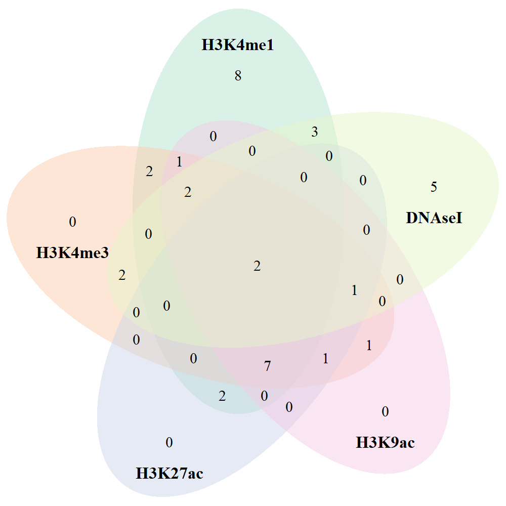

```{r global_options, include=FALSE}
knitr::opts_chunk$set(echo=FALSE, warning=FALSE, message=FALSE)
```


```{r}
# This document depends on the following packages:
library(rlang)
library(dplyr)
library(tibble)
library(readxl)
library(DT)
library(tidyr)
library(data.table)
library(ggplot2)
library(ggrepel)
library(forcats)
library(scales)
library(grid)
library(purrr) # to append multiple dataframes
library(plotly)
library(VennDiagram)
library(RColorBrewer)
library(png)
```

* raw_data.txt file was generated from previous researches on Type-1-diabetes and multiple sclerosis.  
* This file contains only 119 SNPs as common markers for T1D and MS. 

## File preparation
```{r}
T1D_MS_original_119 <- read.table("C:/SANDEEP/MAIN/CAREER/My_papers/PAPERS_in_PROGRESS/T1D_MS/T1D_MS_new/T1D.txt",
                                  header = F) 

knitr::kable(T1D_MS_original_119[1:5, ], align = "lccrr", col.names = c('SNP'), caption = "Table representing SNPs associated with T1D and MS.")
```

* A total of 119 SNPs.
* This file was used to create ANNOVAR formatted file.

### File preparation by ANNOVAR
* Command used in ANNOVAR: 

convert2annovar.pl -format rsid T1D.txt -dbsnpfile humandb/hg19_snp138.txt > T1D_MS_formatted

* 119 SNPs records input; 110 SNPs records as output, 9 SNPs missing

```{r}
# duplicate SNPs due to HLA region were removed from ANNOVAR file
T1D_MS_original_110 <- read.table("C:/SANDEEP/MAIN/CAREER/My_papers/PAPERS_in_PROGRESS/T1D_MS/T1D_MS_new/T1D_MS_formatted.txt",
                                  header = F)
knitr::kable(T1D_MS_original_110[1:5, ], align = "lccrr", caption = "SNPs run in ANNOVAR.")
```

* Identify 9 missing SNPs

```{r}
# Chekcing difference of SNPs in T1D_MS_original_119 file and T1D_MS_original_110 file

setdiff(T1D_MS_original_119$SNP, T1D_MS_original_110$V6)
```

* missing SNP IDs were renamed from PUBMED

      rs6931717 > rs3095345
      
      rs7452756 > rs4516988
      
      rs12199773 > rs3130952
      
      rs6937967 >  rs3130534
      
      rs12178292 > rs2844558
      
      rs10456058 >  rs2734573
      
      rs7382662 >  rs3129305
      
      rs10807118 >  rs3130578
      
      rs10947377 > rs3130179
      
* Created a new file T1D_2.txt after chainging SNP ids
* Rerun in ANNOVAR and obtained results for all 119 SNPs 

```{r}
T1D_MS_new_119 <- read.table("file:///C:/SANDEEP/MAIN/CAREER/My_papers/PAPERS_in_PROGRESS/T1D_MS/T1D_MS_new/T1D_MS_formatted_2.txt", 
                             header = F)

knitr::kable(T1D_MS_new_119[1:5, ], align = "lccrr", caption = "SNP added with 9 missing data.")
```

# ANNOVAR ANALYSIS

## Gene based annotation

### Known Gene (UCSC)
```{r}
Known_T1D <- read.table("C:/SANDEEP/MAIN/CAREER/My_papers/PAPERS_in_PROGRESS/T1D_MS/T1D_MS_new/ANNOVAR_RESULTS/Gene_based/Known_gene_T1D.variant_function", header = F)

colnames(Known_T1D) <- c("Genomic region", "Gene", "Chromosome", "BP_1", "BP_2", "A1", "A2", "SNP") 

knitr::kable(Known_T1D[1:5, ], align = "lccrr", caption = "Table representing SNPs information from known gene.")

Known_T1D$BP_1 <- as.character(Known_T1D$BP_1)
```

### Ensembel Gene
```{r}
Ens_T1D <- read.table("C:/SANDEEP/MAIN/CAREER/My_papers/PAPERS_in_PROGRESS/T1D_MS/T1D_MS_new/ANNOVAR_RESULTS/Gene_based/Ens_gene_T1D.variant_function", header = F)

colnames(Ens_T1D) <- c("Genomic region", "Gene", "Chromosome", "BP_1", "BP_2", "A1", "A2", "SNP") 

knitr::kable(Ens_T1D[1:5, ], align = "lccrr", caption = "Table representing SNPs information from Ensemble gene.")
```      

### Ref Gene (NCBI)
```{r}
Ref_T1D <- read.table("C:/SANDEEP/MAIN/CAREER/My_papers/PAPERS_in_PROGRESS/T1D_MS/T1D_MS_new/ANNOVAR_RESULTS/Gene_based/Ref_gene_T1D.variant_function", header = F)

colnames(Ref_T1D) <- c("Genomic region", "Gene", "Chromosome", "BP_1", "BP_2", "A1", "A2", "SNP") 

knitr::kable(Ref_T1D[1:5, ], align = "lccrr", caption = "Table representing SNPs information from Reference gene.")
```

## Region based annotation

### Conserved genomic elements annotation
```{r}
Con_GE <- fread("file:///C:/SANDEEP/MAIN/CAREER/My_papers/PAPERS_in_PROGRESS/T1D_MS/T1D_MS_new/ANNOVAR_RESULTS/Region_based/T1D_consgenele.hg19_phastConsElements46way") %>%
  separate(V2, c("Con_Sequence_score", "LOD"), sep = ";") %>% 
  rename(SNP = V8) %>% 
  select(Con_Sequence_score, SNP)


knitr::kable(Con_GE, align = "lccrr", caption = "Conserved Genomic Score from NCBI database.")
```

* In evolutionary biology, conserved sequences are identical or similar sequences in nucleic acids (DNA and RNA) or proteins across species (orthologous sequences), or within a genome (paralogous sequences), or between donor and receptor taxa (xenologous sequences). Conservation indicates that a sequence has been maintained by natural selection.

### Transcription factor binding site

```{r}
TFBS <- fread("file:///C:/SANDEEP/MAIN/CAREER/My_papers/PAPERS_in_PROGRESS/T1D_MS/T1D_MS_new/ANNOVAR_RESULTS/Region_based/T1D_TFBS.hg19_tfbsConsSites") %>%
  separate(V2, into = c("Score", "TFBS"), sep = 17) %>% # selecting TFBS site after 17
  select(TFBS, V8) %>%
  rename(SNP = V8) %>% 
  separate(TFBS, c("TFBS", "V1")) %>% 
  select(TFBS, SNP)

knitr::kable(TFBS, align = "lccrr", caption = "Results from Transcription Factor Binding Site using TRANSFAC database.")
```

### Cytogenic band

```{r}
CB <- fread("file:///C:/SANDEEP/MAIN/CAREER/My_papers/PAPERS_in_PROGRESS/T1D_MS/T1D_MS_new/ANNOVAR_RESULTS/Region_based/T1D_cytoband.hg19_cytoBand") %>% 
  select(V2, V8) %>% 
  rename(Cytoband = V2, SNP = V8) 

knitr::kable(CB[1:5, ], align = "lccrr", caption = "Cytogenetic band of all SNPs.")

table(CB$Cytoband)
```

### Variants disrupting microRNAs and snoRNAs (wgRna)

```{r}
micro_sno <- fread("file:///C:/SANDEEP/MAIN/CAREER/My_papers/PAPERS_in_PROGRESS/T1D_MS/T1D_MS_new/ANNOVAR_RESULTS/Region_based/T1D_wgRna.hg19_wgRna") %>% 
  select(V2, V8) %>% 
  rename(wgRNA = V2, SNP = V8)

knitr::kable(micro_sno, align = "lccrr", caption = "Results of variants disrupting microRNAs and snoRNAs.")
```

### Variants located in segmental duplication

```{r}
seg_dup <- fread("C:/SANDEEP/MAIN/CAREER/My_papers/PAPERS_in_PROGRESS/T1D_MS/T1D_MS_new/ANNOVAR_RESULTS/Region_based/T1D_seg_dup.hg19_genomicSuperDups") %>%
  separate(V2, c('Segmental Duplication', 'Name'), sep = ";") %>% 
  select('Segmental Duplication', V8) %>% 
  rename(SNP = V8)

knitr::kable(seg_dup, align = "lccrr", caption = "Results of variants located in segmental duplication region.")
```


### Variants identified in previous GWAS

```{r}
PreGWAS <- fread("file:///C:/SANDEEP/MAIN/CAREER/My_papers/PAPERS_in_PROGRESS/T1D_MS/T1D_MS_new/ANNOVAR_RESULTS/Region_based/T1D_GWAS_SNP.hg19_gwasCatalog") %>%
  separate(V2, c("Name", "Previous GWAS"), sep = "=") %>% 
  select("Previous GWAS", V8) %>% 
  rename(SNP = V8)

knitr::kable(PreGWAS, align = "lccrr", caption = "Results from previous genome-wide association studies.")
```

### Variants in ENCODE annotated region
* Varinats located in transcribed regions in the RNA-Seq data for GM12878 cell lines

#### Variants are located in transcribed regions in the RNA-Seq data for GM12878 cell lines

```{r}
RNA_seq_var <- fread("file:///C:/SANDEEP/MAIN/CAREER/My_papers/PAPERS_in_PROGRESS/T1D_MS/T1D_MS_new/ANNOVAR_RESULTS/Region_based/T1D_ENCODE_anno.hg19_wgEncodeCaltechRnaSeqRawSignalRep1Gm12878CellLongpolyaBb12x75") %>% 
  separate(V2, c("Name", "RNA_seq_raw"), sep = -6) %>% 
  select(RNA_seq_raw, V8) %>% 
  rename(SNP = V8)

knitr::kable(RNA_seq_var[1:5, ], align = "lccrr", caption = "Variants located in transcribed regions in the RNA-Seq data for GM12878 cell lines.")
```

#### Variants located in H3K4me1 ENCODE
```{r}
H3K4me1 <- fread("file:///C:/SANDEEP/MAIN/CAREER/My_papers/PAPERS_in_PROGRESS/T1D_MS/T1D_MS_new/ANNOVAR_RESULTS/Region_based/T1D_H3K4me1.hg19_wgEncodeBroadChipSeqPeaksGm12878H3k4me1") %>%
  separate(V1, c("V1", "H3K4me1"), sep = -7) %>% 
    select(H3K4me1, V8) %>% 
  rename(SNP = V8)

knitr::kable(H3K4me1[1:5, ], align = "lccrr", caption = "Variants located in H3K4me1 region in ENCODE database.")
```

#### Variants in H3K4me3 ENCODE
```{r}
H3K4me3 <- fread("file:///C:/SANDEEP/MAIN/CAREER/My_papers/PAPERS_in_PROGRESS/T1D_MS/T1D_MS_new/ANNOVAR_RESULTS/Region_based/T1D_H3K4me3.hg19_wgEncodeBroadChipSeqPeaksGm12878H3k4me3") %>%
  separate(V1, c("V1", "H3K4me3"), sep = -7) %>% 
    select(H3K4me3, V8) %>% 
  rename(SNP = V8)

knitr::kable(H3K4me3[1:5, ], align = "lccrr", caption = "Variants located in H3K4me3 region in ENCODE database.")
```

#### Variants in H3K9ac ENCODE
```{r}
H3K9ac <- fread("file:///C:/SANDEEP/MAIN/CAREER/My_papers/PAPERS_in_PROGRESS/T1D_MS/T1D_MS_new/ANNOVAR_RESULTS/Region_based/T1D_H3K9ac.hg19_wgEncodeBroadChipSeqPeaksGm12878H3k9ac") %>%
  separate(V1, c("V1", "H3K9ac"), sep = -6) %>% 
    select(H3K9ac, V8) %>% 
  rename(SNP = V8)

knitr::kable(H3K9ac[1:5, ], align = "lccrr", caption = "Variants located in H3K9ac region in ENCODE database.")
```

#### Variants in H3K27ac ENCODE
```{r}
H3K27ac <- fread("file:///C:/SANDEEP/MAIN/CAREER/My_papers/PAPERS_in_PROGRESS/T1D_MS/T1D_MS_new/ANNOVAR_RESULTS/Region_based/T1D_H3K27ac.hg19_wgEncodeBroadChipSeqPeaksGm12878H3k27ac") %>%
  separate(V1, c("V1", "H3K27ac"), sep = -7) %>% 
    select(H3K27ac, V8) %>% 
  rename(SNP = V8)

knitr::kable(H3K27ac[1:5, ], align = "lccrr", caption = "Variants located in H3K27ac region in ENCODE database.")
```

#### variants are located in DNase I hypersensitivity sites from ENCODE
```{r}
DNase_I_hyper <- fread("file:///C:/SANDEEP/MAIN/CAREER/My_papers/PAPERS_in_PROGRESS/T1D_MS/T1D_MS_new/ANNOVAR_RESULTS/Region_based/T1D_DNASE.hg19_wgEncodeRegDnaseClustered") %>% 
  select(V1, V8) %>% 
  rename(DNASE = V1, SNP = V8)
  
DNase_I_hyper$DNASE <- "DNase_hyper"

knitr::kable(DNase_I_hyper[1:5, ], align = "lccrr", caption = "Variants located in DNase I hypersensitivity region in ENCODE database.")
```

```{r}
ENCODE_ANN <- Ref_T1D %>%
  left_join(H3K27ac, by = "SNP") %>%
  left_join(H3K9ac, by = "SNP") %>%
  left_join(H3K4me3, by = "SNP") %>%
  left_join(H3K4me1, by = "SNP") %>%
  left_join(TFBS, by = "SNP") %>%
  left_join(DNase_I_hyper, by = "SNP") %>%
  select(SNP, Gene, BP_1, H3K4me1, H3K4me3, H3K9ac, H3K27ac, TFBS, DNASE) %>%
  rename(BP = "BP_1")

knitr::kable(ENCODE_ANN[1:5, ])
```

Figure Venn diagram of ENCODE data

```{r}
Known_SNP <- Known_T1D %>%
  select(SNP)
Known_SNP$SNP <- as.character(Known_SNP$SNP)

Known_res <- Known_SNP %>%
  left_join(H3K4me3, by = "SNP") %>%
  left_join(H3K9ac, by ="SNP") %>%
  left_join(H3K27ac, by = "SNP") %>%
  left_join(H3K4me1, by = "SNP") %>%
  left_join(DNase_I_hyper, by = "SNP")

H3K4me1 <- Known_res[!is.na(Known_res$H3K4me1),"SNP"]
H3K4me3 <- Known_res[!is.na(Known_res$H3K4me3),"SNP"]
H3K9ac <- Known_res[!is.na(Known_res$H3K9ac),"SNP"]
H3K27ac <- Known_res[!is.na(Known_res$H3K27ac),"SNP"]
DNAseI <- Known_res[!is.na(Known_res$DNASE),"SNP"]

# Prepare a palette of 5 colors with R colorbrewer:
myCol <- brewer.pal(5, "Pastel2")

venn.diagram(
  x = list(H3K4me1, H3K4me3, H3K27ac, H3K9ac, DNAseI),
  category.names = c("H3K4me1", "H3K4me3" , "H3K27ac" , "H3K9ac", "DNAseI"),
  filename = 'ENCODE.png',
  output=TRUE,
  imagetype = "png",
  height = 1000,
  width = 1000,
  resolution = 300,
  compression = "1zw",
  lwd = 0,
  lty = 'blank',
  fill = myCol,
  cex = 0.6,
  cat.cex = 0.65,
  cat.fontface = "bold",
  cat.pos = 0,
  cat.dist = c(0.07, -0.07, -0.07, -0.07,  -0.07))
```

```{r fig.align="center", out.width = "50%"}

```

# RegulomeDB results
```{r}
# RegulomeDB files were downloaded from RegulomeDB database
# Reading multiple files in R for regulomeDB analysis
# path <- setwd("C:/SANDEEP/MAIN/CAREER/My_papers/PAPERS_in_PROGRESS/T1D_MS/T1D_MS_new/RegulomeDB_Results")
# file.list <- list.files(path = ".", pattern = "*xlsx")
# RDB.list <- lapply(file.list, read_excel)
```

```{r}
# RDB_T1D <- bind_rows(RDB.list, .id = "id") %>% 
#   rename(Regulome_DB = "RDB_score")

# write.table(RDB_T1D, file = "RegulomeDB_score.txt",
#             sep = "\t",
#             row.names = FALSE,
#             col.names = TRUE,
#             quote = FALSE)
```

```{r}
RDB_T1D <- fread("C:/SANDEEP/MAIN/CAREER/My_papers/PAPERS_in_PROGRESS/T1D_MS/T1D_MS_new/RegulomeDB_Results/RegulomeDB_score.txt")

knitr::kable(RDB_T1D[1:5, ], align = "lccrr", caption = "RegulomeDB score.")
```

```{r}
table(RDB_T1D$RDB_score)
```

Figure Bar chart representing RegulomeDB score
```{r, fig.align="center", fig.width=6, fig.height=6, fig.cap="Figure 1: Bar chart representing RegulomeDB score"}
ggplot(RDB_T1D, aes(x = RDB_score, fill = RDB_score))+
  geom_bar()+
  labs(x = "RegulomeDB score", y = "Total number of SNPs")+
  theme_classic()+
  theme(legend.position = "none")
```

