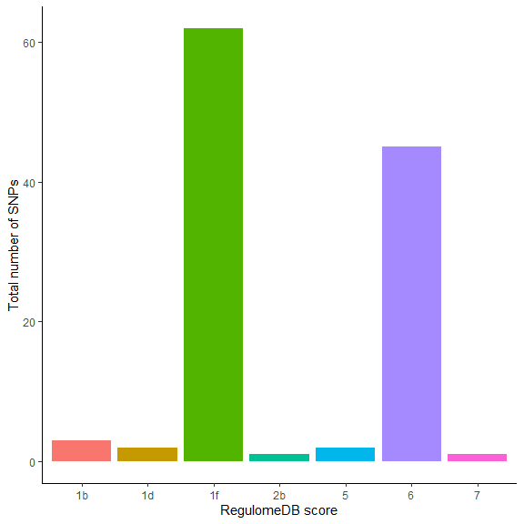

* raw_data.txt file was generated from previous researches on Type-1-diabetes and multiple sclerosis.  
* This file contains only 119 SNPs as common markers for T1D and MS. 

## File preparation

Table: Table representing SNPs associated with T1D and MS.

|SNP       |
|:---------|
|rs1632953 |
|rs1059174 |
|rs1736921 |
|rs1736916 |
|rs1736913 |

* A total of 119 SNPs.
* This file was used to create ANNOVAR formatted file.

### File preparation by ANNOVAR
* Command used in ANNOVAR: 

convert2annovar.pl -format rsid T1D.txt -dbsnpfile humandb/hg19_snp138.txt > T1D_MS_formatted

* 119 SNPs records input; 110 SNPs records as output, 9 SNPs missing


Table: SNPs run in ANNOVAR.

|V1   |    V2    |    V3    | V4| V5|V6        |
|:----|:--------:|:--------:|--:|--:|:---------|
|chr6 | 29692305 | 29692305 |  A|  G|rs1632953 |
|chr6 | 29694427 | 29694427 |  C|  T|rs1059174 |
|chr6 | 29696209 | 29696209 |  G|  A|rs1736921 |
|chr6 | 29704083 | 29704083 |  C|  T|rs1736916 |
|chr6 | 29704400 | 29704400 |  T|  C|rs1736913 |

* Identify 9 missing SNPs


```
## NULL
```

* missing SNP IDs were renamed from PUBMED

      rs6931717 > rs3095345
      
      rs7452756 > rs4516988
      
      rs12199773 > rs3130952
      
      rs6937967 >  rs3130534
      
      rs12178292 > rs2844558
      
      rs10456058 >  rs2734573
      
      rs7382662 >  rs3129305
      
      rs10807118 >  rs3130578
      
      rs10947377 > rs3130179
      
* Created a new file T1D_2.txt after chainging SNP ids
* Rerun in ANNOVAR and obtained results for all 119 SNPs 


Table: SNP added with 9 missing data.

|V1   |    V2    |    V3    | V4| V5|V6        |
|:----|:--------:|:--------:|--:|--:|:---------|
|chr6 | 29692305 | 29692305 |  A|  G|rs1632953 |
|chr6 | 29694427 | 29694427 |  C|  T|rs1059174 |
|chr6 | 29696209 | 29696209 |  G|  A|rs1736921 |
|chr6 | 29704083 | 29704083 |  C|  T|rs1736916 |
|chr6 | 29704400 | 29704400 |  T|  C|rs1736913 |

# ANNOVAR ANALYSIS

## Gene based annotation

### Known Gene (UCSC)

Table: Table representing SNPs information from known gene.

|Genomic region |   Gene    | Chromosome |     BP_1|     BP_2|A1 | A2 |    SNP    |
|:--------------|:---------:|:----------:|--------:|--------:|:--|:--:|:---------:|
|intronic       |   HLA-F   |    chr6    | 29692305| 29692305|A  | G  | rs1632953 |
|ncRNA_exonic   | HLA-F-AS1 |    chr6    | 29694427| 29694427|C  | T  | rs1059174 |
|ncRNA_exonic   | HLA-F-AS1 |    chr6    | 29696209| 29696209|G  | A  | rs1736921 |
|ncRNA_exonic   | HLA-F-AS1 |    chr6    | 29704083| 29704083|C  | T  | rs1736916 |
|ncRNA_exonic   | HLA-F-AS1 |    chr6    | 29704400| 29704400|T  | C  | rs1736913 |

### Ensembel Gene

Table: Table representing SNPs information from Ensemble gene.

|Genomic region |      Gene       | Chromosome |     BP_1|     BP_2|A1 | A2 |    SNP    |
|:--------------|:---------------:|:----------:|--------:|--------:|:--|:--:|:---------:|
|intronic       | ENSG00000204642 |    chr6    | 29692305| 29692305|A  | G  | rs1632953 |
|ncRNA_exonic   | ENSG00000214922 |    chr6    | 29694427| 29694427|C  | T  | rs1059174 |
|ncRNA_exonic   | ENSG00000214922 |    chr6    | 29696209| 29696209|G  | A  | rs1736921 |
|ncRNA_exonic   | ENSG00000214922 |    chr6    | 29704083| 29704083|C  | T  | rs1736916 |
|ncRNA_exonic   | ENSG00000214922 |    chr6    | 29704400| 29704400|T  | C  | rs1736913 |

### Ref Gene (NCBI)

Table: Table representing SNPs information from Reference gene.

|Genomic region |   Gene    | Chromosome |     BP_1|     BP_2|A1 | A2 |    SNP    |
|:--------------|:---------:|:----------:|--------:|--------:|:--|:--:|:---------:|
|intronic       |   HLA-F   |    chr6    | 29692305| 29692305|A  | G  | rs1632953 |
|ncRNA_exonic   | HLA-F-AS1 |    chr6    | 29694427| 29694427|C  | T  | rs1059174 |
|ncRNA_exonic   | HLA-F-AS1 |    chr6    | 29696209| 29696209|G  | A  | rs1736921 |
|ncRNA_intronic | HLA-F-AS1 |    chr6    | 29704083| 29704083|C  | T  | rs1736916 |
|ncRNA_intronic | HLA-F-AS1 |    chr6    | 29704400| 29704400|T  | C  | rs1736913 |

## Region based annotation

### Conserved genomic elements annotation

Table: Conserved Genomic Score from NCBI database.

|Con_Sequence_score |    SNP     |
|:------------------|:----------:|
|Score=737          | rs1059174  |
|Score=284          | rs3130558  |
|Score=798          | rs6906846  |
|Score=369          | rs7382297  |
|Score=511          | rs2736172  |
|Score=304          | rs2076530  |
|Score=340          | rs9268831  |
|Score=361          | rs17840186 |

* In evolutionary biology, conserved sequences are identical or similar sequences in nucleic acids (DNA and RNA) or proteins across species (orthologous sequences), or within a genome (paralogous sequences), or between donor and receptor taxa (xenologous sequences). Conservation indicates that a sequence has been maintained by natural selection.

### Transcription factor binding site


Table: Results from Transcription Factor Binding Site using TRANSFAC database.

|TFBS |    SNP     |
|:----|:----------:|
|XBP1 | rs2736172  |
|CEBP |  rs415929  |
|ATF6 | rs9268831  |
|YY1  | rs17840186 |

### Cytogenic band


Table: Cytogenetic band of all SNPs.

|Cytoband |    SNP     |
|:--------|:----------:|
|6p22.1   | rs1632953  |
|6p22.1   | rs1059174  |
|6p22.1   | rs1736921  |
|6p22.1   | rs1736916  |
|6p22.1   | rs1736913  |
|6p22.1   | rs1610603  |
|6p22.1   | rs1633070  |
|6p22.1   | rs1633069  |
|6p22.1   | rs1610630  |
|6p22.1   | rs1737068  |
|6p22.1   | rs1737060  |
|6p22.1   | rs2517646  |
|6p21.33  | rs2516675  |
|6p21.33  | rs3130000  |
|6p21.33  | rs3094123  |
|6p21.33  | rs3095345  |
|6p21.33  | rs2530709  |
|6p21.33  | rs2517538  |
|6p21.33  | rs4713429  |
|6p21.33  | rs9262615  |
|6p21.33  | rs2523881  |
|6p21.33  | rs2523880  |
|6p21.33  | rs2233969  |
|6p21.33  | rs1265052  |
|6p21.33  | rs2233967  |
|6p21.33  | rs3130981  |
|6p21.33  | rs3095324  |
|6p21.33  | rs3095314  |
|6p21.33  | rs3130558  |
|6p21.33  | rs3131009  |
|6p21.33  | rs3130564  |
|6p21.33  | rs2073723  |
|6p21.33  | rs2106074  |
|6p21.33  | rs9263804  |
|6p21.33  | rs3130501  |
|6p21.33  | rs3132524  |
|6p21.33  | rs3095238  |
|6p21.33  | rs4516988  |
|6p21.33  | rs3130952  |
|6p21.33  | rs9295965  |
|6p21.33  | rs3130531  |
|6p21.33  | rs3095250  |
|6p21.33  | rs3130532  |
|6p21.33  | rs3130534  |
|6p21.33  | rs3132486  |
|6p21.33  | rs6906846  |
|6p21.33  | rs7382297  |
|6p21.33  | rs2524095  |
|6p21.33  | rs2524089  |
|6p21.33  | rs2523535  |
|6p21.33  | rs2523534  |
|6p21.33  | rs2596437  |
|6p21.33  | rs2844558  |
|6p21.33  | rs5025315  |
|6p21.33  | rs5022119  |
|6p21.33  | rs2523638  |
|6p21.33  | rs3997982  |
|6p21.33  | rs2596571  |
|6p21.33  | rs2523485  |
|6p21.33  | rs2596517  |
|6p21.33  | rs2516460  |
|6p21.33  | rs3131622  |
|6p21.33  | rs2248373  |
|6p21.33  | rs2523650  |
|6p21.33  | rs2904776  |
|6p21.33  | rs2905747  |
|6p21.33  | rs9267247  |
|6p21.33  | rs3131631  |
|6p21.33  | rs2734573  |
|6p21.33  | rs2736177  |
|6p21.33  | rs2736172  |
|6p21.33  |  rs760293  |
|6p21.33  | rs3130287  |
|6p21.32  | rs3131294  |
|6p21.32  |  rs438475  |
|6p21.32  |  rs415929  |
|6p21.32  | rs3115576  |
|6p21.32  | rs9267971  |
|6p21.32  | rs3130311  |
|6p21.32  |  rs910049  |
|6p21.32  | rs6907322  |
|6p21.32  | rs3129934  |
|6p21.32  | rs12528797 |
|6p21.32  | rs2076530  |
|6p21.32  | rs3806156  |
|6p21.32  | rs7756262  |
|6p21.32  | rs9268645  |
|6p21.32  | rs3129877  |
|6p21.32  | rs3135392  |
|6p21.32  | rs9268831  |
|6p21.32  | rs9268877  |
|6p21.32  | rs9275765  |
|6p21.32  | rs9275772  |
|6p21.32  | rs9461799  |
|6p21.32  | rs9469240  |
|6p21.32  | rs9275793  |
|6p21.32  | rs2227127  |
|6p21.32  | rs9276429  |
|6p21.32  | rs9276431  |
|6p21.32  | rs9276432  |
|6p21.32  | rs9276440  |
|6p21.32  | rs7768538  |
|6p21.32  | rs7453920  |
|6p21.32  | rs2051549  |
|6p21.32  | rs6902723  |
|6p21.32  | rs6903130  |
|6p21.32  | rs9296044  |
|6p21.32  | rs2857212  |
|6p21.32  | rs2621382  |
|6p21.32  |  rs241427  |
|6p21.32  | rs9276825  |
|6p21.32  |  rs241403  |
|6p21.32  | rs3101942  |
|6p21.32  | rs1050391  |
|6p21.32  | rs11539216 |
|6p21.32  | rs17840186 |
|6p21.32  | rs3129305  |
|6p21.32  | rs3130578  |
|6p21.32  | rs3130179  |

### Variants disrupting microRNAs and snoRNAs (wgRna)


Table: Results of variants disrupting microRNAs and snoRNAs.

|wgRNA      |    SNP    |
|:----------|:---------:|
|Name=ACA38 | rs2736172 |

# RegulomeDB results


Table: RegulomeDB score.

|Chr  |    SNP    | RDB_score |
|:----|:---------:|:---------:|
|chr6 | rs2517646 |    1b     |
|chr6 | rs1632953 |    1f     |
|chr6 | rs1059174 |    1f     |
|chr6 | rs1736921 |    1f     |
|chr6 | rs1736916 |    1f     |


```
## 
## 1b 1d 1f 2b  5  6  7 
##  3  2 62  1  2 45  1
```

Figure Bar chart representing RegulomeDB score
<div class="figure" style="text-align: center">

<p class="caption">Figure 1: Bar chart representing RegulomeDB score</p>
</div>

