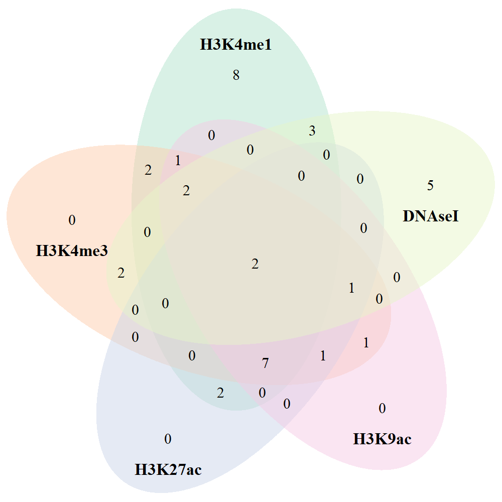

* raw_data.txt file was generated from previous researches on Type-1-diabetes and multiple sclerosis.  
* This file contains only 119 SNPs as common markers for T1D and MS. 

## File preparation

Table: Table representing SNPs associated with T1D and MS.

|SNP       |
|:---------|
|rs1632953 |
|rs1059174 |
|rs1736921 |
|rs1736916 |
|rs1736913 |

* A total of 119 SNPs.
* This file was used to create ANNOVAR formatted file.

### File preparation by ANNOVAR
* Command used in ANNOVAR: 

convert2annovar.pl -format rsid T1D.txt -dbsnpfile humandb/hg19_snp138.txt > T1D_MS_formatted

* 119 SNPs records input; 110 SNPs records as output, 9 SNPs missing


Table: SNPs run in ANNOVAR.

|V1   |    V2    |    V3    | V4| V5|V6        |
|:----|:--------:|:--------:|--:|--:|:---------|
|chr6 | 29692305 | 29692305 |  A|  G|rs1632953 |
|chr6 | 29694427 | 29694427 |  C|  T|rs1059174 |
|chr6 | 29696209 | 29696209 |  G|  A|rs1736921 |
|chr6 | 29704083 | 29704083 |  C|  T|rs1736916 |
|chr6 | 29704400 | 29704400 |  T|  C|rs1736913 |

* Identify 9 missing SNPs


```
## NULL
```

* missing SNP IDs were renamed from PUBMED

      rs6931717 > rs3095345
      
      rs7452756 > rs4516988
      
      rs12199773 > rs3130952
      
      rs6937967 >  rs3130534
      
      rs12178292 > rs2844558
      
      rs10456058 >  rs2734573
      
      rs7382662 >  rs3129305
      
      rs10807118 >  rs3130578
      
      rs10947377 > rs3130179
      
* Created a new file T1D_2.txt after chainging SNP ids
* Rerun in ANNOVAR and obtained results for all 119 SNPs 


Table: SNP added with 9 missing data.

|V1   |    V2    |    V3    | V4| V5|V6        |
|:----|:--------:|:--------:|--:|--:|:---------|
|chr6 | 29692305 | 29692305 |  A|  G|rs1632953 |
|chr6 | 29694427 | 29694427 |  C|  T|rs1059174 |
|chr6 | 29696209 | 29696209 |  G|  A|rs1736921 |
|chr6 | 29704083 | 29704083 |  C|  T|rs1736916 |
|chr6 | 29704400 | 29704400 |  T|  C|rs1736913 |

# ANNOVAR ANALYSIS

## Gene based annotation

### Known Gene (UCSC)

Table: Table representing SNPs information from known gene.

|Genomic region |   Gene    | Chromosome |     BP_1|     BP_2|A1 | A2 |    SNP    |
|:--------------|:---------:|:----------:|--------:|--------:|:--|:--:|:---------:|
|intronic       |   HLA-F   |    chr6    | 29692305| 29692305|A  | G  | rs1632953 |
|ncRNA_exonic   | HLA-F-AS1 |    chr6    | 29694427| 29694427|C  | T  | rs1059174 |
|ncRNA_exonic   | HLA-F-AS1 |    chr6    | 29696209| 29696209|G  | A  | rs1736921 |
|ncRNA_exonic   | HLA-F-AS1 |    chr6    | 29704083| 29704083|C  | T  | rs1736916 |
|ncRNA_exonic   | HLA-F-AS1 |    chr6    | 29704400| 29704400|T  | C  | rs1736913 |

### Ensembel Gene

Table: Table representing SNPs information from Ensemble gene.

|Genomic region |      Gene       | Chromosome |     BP_1|     BP_2|A1 | A2 |    SNP    |
|:--------------|:---------------:|:----------:|--------:|--------:|:--|:--:|:---------:|
|intronic       | ENSG00000204642 |    chr6    | 29692305| 29692305|A  | G  | rs1632953 |
|ncRNA_exonic   | ENSG00000214922 |    chr6    | 29694427| 29694427|C  | T  | rs1059174 |
|ncRNA_exonic   | ENSG00000214922 |    chr6    | 29696209| 29696209|G  | A  | rs1736921 |
|ncRNA_exonic   | ENSG00000214922 |    chr6    | 29704083| 29704083|C  | T  | rs1736916 |
|ncRNA_exonic   | ENSG00000214922 |    chr6    | 29704400| 29704400|T  | C  | rs1736913 |

### Ref Gene (NCBI)

Table: Table representing SNPs information from Reference gene.

|Genomic region |   Gene    | Chromosome |     BP_1|     BP_2|A1 | A2 |    SNP    |
|:--------------|:---------:|:----------:|--------:|--------:|:--|:--:|:---------:|
|intronic       |   HLA-F   |    chr6    | 29692305| 29692305|A  | G  | rs1632953 |
|ncRNA_exonic   | HLA-F-AS1 |    chr6    | 29694427| 29694427|C  | T  | rs1059174 |
|ncRNA_exonic   | HLA-F-AS1 |    chr6    | 29696209| 29696209|G  | A  | rs1736921 |
|ncRNA_intronic | HLA-F-AS1 |    chr6    | 29704083| 29704083|C  | T  | rs1736916 |
|ncRNA_intronic | HLA-F-AS1 |    chr6    | 29704400| 29704400|T  | C  | rs1736913 |

## Region based annotation

### Conserved genomic elements annotation

Table: Conserved Genomic Score from NCBI database.

|Con_Sequence_score |    SNP     |
|:------------------|:----------:|
|Score=737          | rs1059174  |
|Score=284          | rs3130558  |
|Score=798          | rs6906846  |
|Score=369          | rs7382297  |
|Score=511          | rs2736172  |
|Score=304          | rs2076530  |
|Score=340          | rs9268831  |
|Score=361          | rs17840186 |

* In evolutionary biology, conserved sequences are identical or similar sequences in nucleic acids (DNA and RNA) or proteins across species (orthologous sequences), or within a genome (paralogous sequences), or between donor and receptor taxa (xenologous sequences). Conservation indicates that a sequence has been maintained by natural selection.

### Transcription factor binding site


Table: Results from Transcription Factor Binding Site using TRANSFAC database.

|TFBS |    SNP     |
|:----|:----------:|
|XBP1 | rs2736172  |
|CEBP |  rs415929  |
|ATF6 | rs9268831  |
|YY1  | rs17840186 |

### Cytogenic band


Table: Cytogenetic band of all SNPs.

|Cytoband |    SNP    |
|:--------|:---------:|
|6p22.1   | rs1632953 |
|6p22.1   | rs1059174 |
|6p22.1   | rs1736921 |
|6p22.1   | rs1736916 |
|6p22.1   | rs1736913 |

```
## 
## 6p21.32 6p21.33  6p22.1 
##      46      61      12
```

### Variants disrupting microRNAs and snoRNAs (wgRna)


Table: Results of variants disrupting microRNAs and snoRNAs.

|wgRNA      |    SNP    |
|:----------|:---------:|
|Name=ACA38 | rs2736172 |

### Variants located in segmental duplication


Table: Results of variants located in segmental duplication region.

|Segmental Duplication |    SNP    |
|:---------------------|:---------:|
|Score=0.898257        | rs2516675 |
|Score=0.8991          | rs3130531 |
|Score=0.8991          | rs3095250 |
|Score=0.8991          | rs3130532 |
|Score=0.8991          | rs3130534 |
|Score=0.8991          | rs3132486 |
|Score=0.934896        | rs2523535 |
|Score=0.934896        | rs2523534 |
|Score=0.928926        | rs2596517 |
|Score=0.928926        | rs9267247 |


### Variants identified in previous GWAS


Table: Results from previous genome-wide association studies.

|Previous GWAS                                                     |    SNP    |
|:-----------------------------------------------------------------|:---------:|
|Stevens-Johnson syndrome and toxic epidermal necrolysis (SJS-TEN) | rs3130501 |
|Type 2 diabetes                                                   | rs3132524 |
|Psychosis (atypical)                                              | rs2736172 |
|Hepatitis C induced liver cirrhosis                               | rs910049  |
|Multiple sclerosis                                                | rs3129934 |
|Sarcoidosis                                                       | rs2076530 |
|Vitiligo                                                          | rs3806156 |
|Type 1 diabetes                                                   | rs9268645 |
|Ulcerative colitis                                                | rs9268877 |
|Chronic hepatitis B infection,Hepatitis B,Lymphoma                | rs7453920 |
|Systemic lupus erythematosus                                      | rs2051549 |

### Variants in ENCODE annotated region
* Varinats located in transcribed regions in the RNA-Seq data for GM12878 cell lines

#### Variants are located in transcribed regions in the RNA-Seq data for GM12878 cell lines


Table: Variants located in transcribed regions in the RNA-Seq data for GM12878 cell lines.

|RNA_seq_raw |    SNP    |
|:-----------|:---------:|
|514097      | rs1632953 |
|514098      | rs1736921 |
|514102      | rs1736916 |
|514103      | rs1736913 |
|514106      | rs1610603 |

#### Variants located in H3K4me1 ENCODE

Table: Variants located in H3K4me1 region in ENCODE database.

|H3K4me1 |    SNP    |
|:-------|:---------:|
|H3k4me1 | rs1736916 |
|H3k4me1 | rs1736913 |
|H3k4me1 | rs1610603 |
|H3k4me1 | rs1737068 |
|H3k4me1 | rs1737060 |

#### Variants in H3K4me3 ENCODE

Table: Variants located in H3K4me3 region in ENCODE database.

|H3K4me3 |    SNP    |
|:-------|:---------:|
|H3k4me3 | rs1736916 |
|H3k4me3 | rs1736913 |
|H3k4me3 | rs1610603 |
|H3k4me3 | rs2073723 |
|H3k4me3 | rs2523638 |

#### Variants in H3K9ac ENCODE

Table: Variants located in H3K9ac region in ENCODE database.

|H3K9ac |    SNP    |
|:------|:---------:|
|H3k9ac | rs1736916 |
|H3k9ac | rs1736913 |
|H3k9ac | rs1610603 |
|H3k9ac | rs2596571 |
|H3k9ac | rs760293  |

#### Variants in H3K27ac ENCODE

Table: Variants located in H3K27ac region in ENCODE database.

|H3K27ac |    SNP    |
|:-------|:---------:|
|H3k27ac | rs2596571 |
|H3k27ac | rs2227127 |
|H3k27ac | rs9276429 |
|H3k27ac | rs9276431 |
|H3k27ac | rs9276432 |

#### variants are located in DNase I hypersensitivity sites from ENCODE

Table: Variants located in DNase I hypersensitivity region in ENCODE database.

|DNASE       |    SNP    |
|:-----------|:---------:|
|DNase_hyper | rs1736916 |
|DNase_hyper | rs1610603 |
|DNase_hyper | rs1610630 |
|DNase_hyper | rs3095345 |
|DNase_hyper | rs2233969 |


|SNP       |Gene      |       BP|H3K4me1 |H3K4me3 |H3K9ac |H3K27ac |TFBS |DNASE       |
|:---------|:---------|--------:|:-------|:-------|:------|:-------|:----|:-----------|
|rs1632953 |HLA-F     | 29692305|NA      |NA      |NA     |NA      |NA   |NA          |
|rs1059174 |HLA-F-AS1 | 29694427|NA      |NA      |NA     |NA      |NA   |NA          |
|rs1736921 |HLA-F-AS1 | 29696209|NA      |NA      |NA     |NA      |NA   |NA          |
|rs1736916 |HLA-F-AS1 | 29704083|H3k4me1 |H3k4me3 |H3k9ac |NA      |NA   |DNase_hyper |
|rs1736913 |HLA-F-AS1 | 29704400|H3k4me1 |H3k4me3 |H3k9ac |NA      |NA   |NA          |

Figure Venn diagram of ENCODE data


```
## [1] 1
```



# RegulomeDB results


Table: RegulomeDB score.

|Chr  |    SNP    | RDB_score |
|:----|:---------:|:---------:|
|chr6 | rs2517646 |    1b     |
|chr6 | rs1632953 |    1f     |
|chr6 | rs1059174 |    1f     |
|chr6 | rs1736921 |    1f     |
|chr6 | rs1736916 |    1f     |


```
## 
## 1b 1d 1f 2b  5  6  7 
##  3  2 62  1  2 45  1
```

Figure Bar chart representing RegulomeDB score
<div class="figure" style="text-align: center">

<p class="caption">Figure 1: Bar chart representing RegulomeDB score</p>
</div>

